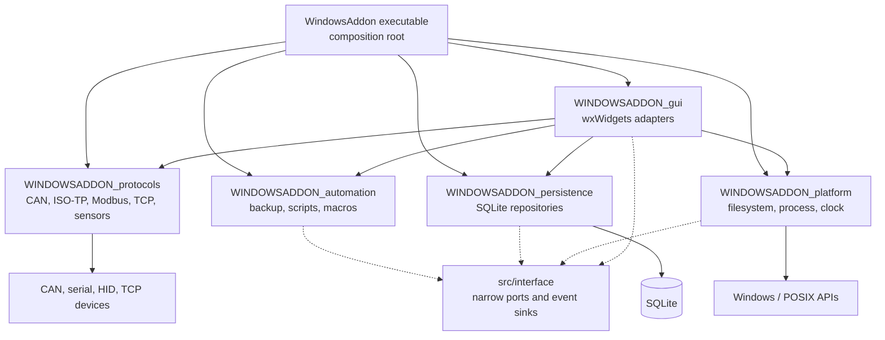
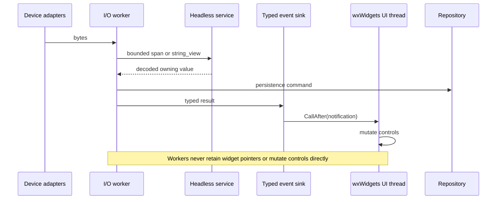

# Architecture

WindowsAddon is being migrated from a single wxWidgets executable to small,
testable libraries. The CMake build currently exposes these production targets:

| Target | Responsibility | GUI-free |
| --- | --- | --- |
| `WINDOWSADDON_protocols` | CAN codecs, ISO-TP support, Modbus client, sensor parsing | Yes |
| `WINDOWSADDON_persistence` | SQLite-backed repositories and storage | Yes |
| `WINDOWSADDON_automation` | Backup core, script launch policy, string/macro logic | Yes |
| `WINDOWSADDON_platform` | Standard filesystem, process, and clock adapters | Yes |
| `WINDOWSADDON_gui` | wxWidgets panels, dialogs, frames, and tray UI | No |

The `WindowsAddon` executable is the composition root. It constructs the real
platform adapters and injects them into application services. Older services
that have not moved into a library yet remain in the executable target; new
code should not add platform or wxWidgets dependencies to the four headless
libraries.

## Dependency boundaries

The small interfaces in `src/interface` are the stable dependency direction:

- `ICanTransport` decouples CAN behavior from `CanSerialPort`. `CanEntryHandler`
  receives it in its constructor, and ISO-TP now supports callbacks per link.
- `ISerialTransport` is the minimal serial lifecycle. The broader legacy
  `ISerialPort` extends it together with the separate configuration interfaces.
- `ICommandRunner` and `IFileSystem` are injected into `ScriptLaunchService`;
  `IScriptCommandResolver` supplies its extensible interpreter policy, and
  `CmdExecutor` receives the command runner and `ICommandTextResolver`.
- `IClock` supplies monotonic time to CAN scheduling and recording.
- `IDatabase` remains the persistence boundary used by repositories.
- `ITimeTrackerStorage` keeps time-tracker behavior independent of SQLite;
  `MyApp` injects the `TimeTrackerStorage` adapter.
- `ICanEventSink`, `IBackupEventSink`, and `IModbusEventSink` keep application
  behavior independent from wxWidgets notifications.
- `ICanDeviceFactory` selects the CAN framing strategy. CAN devices return
  decoded frames through a callback and never call the transport singleton.
- `GraphGenerator` returns an owning `GraphData` value. It never mutates
  `Sensors` from its worker thread, so the sensor/database/graph dependency is
  one-way and cross-thread publication is explicit.

Tests link the same headless library targets as production. Fakes implement the
interfaces directly; no test-only conditional compilation is used.

## Runtime and concurrency flow

Workers own I/O and parsing. They publish owning values or typed notifications;
only the UI thread touches wxWidgets controls.

## Enforced boundary rules

- Headless targets must not include wxWidgets or call `wxGetApp()`.
- `MyApp::OnInit()` chooses concrete adapters; services receive the narrowest
  useful interface through construction.
- Workers transfer owning values or closed notification variants across thread
  boundaries. GUI mutation is marshalled with `CallAfter`.
- Wire data is parsed from bounded spans or string views. No parser relies on a
  trailing NUL or reinterprets byte storage as an integer.
- New behavior belongs in a headless target first; the GUI remains an adapter.

The remaining `CSingleton`/`wxGetApp()` calls are a legacy compatibility seam
at the GUI and hardware edge, not the pattern for new business logic. Their
lifecycle is centralized in `MyApp::OnExit()`; `TryGet()` must be used during
teardown to prevent service resurrection. Cross-service cycles and worker-to-
GUI singleton calls are prohibited. Touched GUI components should receive
owned services from `MyApp`, as `CmdExecutorPanel` now does.

## Architecture decisions

The reasoning and trade-offs behind the important boundaries are recorded as
short architecture decision records:

- [ADR-0001: Headless libraries and a composition root](adr/0001-headless-libraries-and-composition-root.md)
- [ADR-0002: Typed publication from workers to the GUI](adr/0002-typed-worker-to-gui-publication.md)
- [ADR-0003: Length-bounded byte-oriented parsing](adr/0003-length-bounded-byte-oriented-parsing.md)
- [ADR-0004: Maintain CMake and native Visual Studio builds](adr/0004-dual-cmake-and-msbuild-support.md)

## Executable evidence

The rules above are backed by tests that link production libraries rather than
copies of their implementation.

| Invariant | Production code | Regression evidence |
| --- | --- | --- |
| TCP input never requires or writes a trailing NUL, including a full 1024-byte read | [`TcpMessageParser`](../src/TcpMessageParser.cpp), [`Session`](../src/Session.cpp) | [`TcpMessageParserTests`](../tests/TcpMessageParserTests.cpp), [`NetworkMessageFuzz`](../fuzz/NetworkMessageFuzz.cpp) |
| CAN stream decoders recover from noise and keep internal buffers bounded | [`CanCodecs`](../src/CanCodecs.cpp) | [`CanCodecTests`](../tests/CanCodecTests.cpp), [`ProtocolParsersFuzz`](../fuzz/ProtocolParsersFuzz.cpp) |
| ISO-TP handles segmentation, flow control, sequence errors, and timeouts | [`isotp`](../libs/isotp/isotp.c) | [`IsoTpTests`](../tests/IsoTpTests.cpp), [`ProtocolParsersFuzz`](../fuzz/ProtocolParsersFuzz.cpp) |
| Modbus validates CRC, slave/function identity, exception frames, and response sizes | [`ModbusClient`](../src/ModbusClient.cpp) | [`ModbusClientTests`](../tests/ModbusClientTests.cpp), [`ProtocolParsersFuzz`](../fuzz/ProtocolParsersFuzz.cpp) |
| Sensor broadcasts are parsed from explicit lengths | [`SensorDataParser`](../src/SensorDataParser.cpp) | [`SensorDataParserTests`](../tests/SensorDataParserTests.cpp), [`ProtocolParsersFuzz`](../fuzz/ProtocolParsersFuzz.cpp) |
| Observers may detach during a callback without invalidating iteration | [`ICanSubscriber`](../src/interface/ICanSubscriber.hpp) | [`ObserverTests`](../tests/ObserverTests.cpp) |
| Script launching depends on injected policy, filesystem, and process ports | [`ScriptLaunchService`](../src/automation/ScriptLaunchService.cpp) | [`ScriptLaunchServiceTests`](../tests/ScriptLaunchServiceTests.cpp) |
| Time-tracker behavior is independent of its SQLite adapter | [`TimeTrackerStorage`](../src/TimeTrackerStorage.cpp) | [`TimeTrackerStorageTests`](../tests/TimeTrackerStorageTests.cpp) |

## Resolved design violations

| Previous violation | Resolution |
| --- | --- |
| A backup worker captured a pointer into an erasable configuration vector | Jobs capture an immutable `BackupEntry` value; the catalog is mutex-protected and exposed through copy/update operations. |
| CAN protocol strategies called `CanSerialPort::Get()` | Devices emit decoded frames through the injected callback; construction moved to `ICanDeviceFactory`. |
| `GraphGenerator` wrote directly into `Sensors` on a background thread | The generator publishes one owning `GraphData` result, consumed by `Sensors` under its state lock. |
| Observer/helper pointers could outlive wx panels | Panels explicitly detach; helper calls and detach operations share a lifetime mutex; singleton teardown uses non-creating `TryGet()`. |
| Sensor, CAN, and Modbus workers updated wx controls directly | GUI adapters marshal callbacks with `CallAfter`; Modbus polling publishes through `IModbusHelper` and no longer receives panel pointers. |
| UI notifications used `deque<vector<any>>` | A closed `AppNotification` variant makes every payload compile-time checked and queue mutation private. |
| Domain models stored `wxSize` and widget pointers | `LogicalSize`, `TextStyle`, and `DataEntryPresentation` are GUI-free; wx conversion happens in the panel adapter. |
| Server and backup state was publicly mutable across threads | Both components now expose synchronized commands and value snapshots. |
| POSIX `ICommandRunner::Start` blocked despite its contract | It now uses `posix_spawn` plus an asynchronous child reaper. |
| A command name branch modified execution inside `Command` | Command preparation is an injected, extensible resolver strategy. |
| Measurement copies corrupted the integration sample count | `Measurement` is a regular value object whose aggregation uses the actual accumulated count. |

These rules are covered by headless regression tests and by a full application
compile. New code must not reintroduce raw positional events, reverse singleton
callbacks, GUI types in domain models, or worker mutation of GUI-owned state.

## CAN byte order and alignment

CAN payloads are stored as byte arrays and passed as `std::span`. Code must not
reinterpret byte buffers as integer pointers: that is alignment-dependent and
also makes wire order depend on the host. Protocol code should serialize each
byte explicitly, as the STM32 and Modbus codecs do.

## Migration rule

When changing a legacy service, move its non-GUI behavior into the matching
headless target first, inject the smallest required interface, and keep only the
wxWidgets adapter in `WINDOWSADDON_gui`. The executable should contain wiring,
not new business logic.
